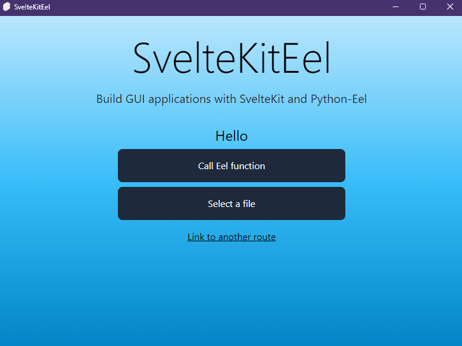

<h1 align="center">
    Python-Eel-Electron.js-SvelteKit-Boilerplate
</h1>

```
git clone https://github.com/whinee/Python-Eel-Electron.js-SvelteKit-Boilerplate.git
```

<div align="center">



</div>

## About

Python-Eel-Electron.js-SvelteKit-Boilerplate is, as the name implies, a Python-Eel-Electron.js-SvelteKit boilerplate for making a functional desktop app using said technologies. This combines two main technologies:

- Electron: ["A framework that allows developers to build cross-platform desktop applications using web technologies"](https://github.com/electron/electron)
- Eel: A Python library for ["making simple Electron-like offline HTML/JS GUI apps."](https://github.com/python-eel/Eel)
- SvelteKit: ["A framework for rapidly developing robust, performant web applications using Svelte"](https://kit.svelte.dev/docs/introduction)
  - SvelteKit will be running in SPA mode.

This template also comes with Tailwind CSS preconfigured.

This repository is a fork of repository named [create-sveltekit-eel-app](https://github.com/WiIIiamTang/create-sveltekit-eel-app) by [WiIIiamTang](https://github.com/WiIIiamTang) in Github. I just removed the CLI part and made the base+tailwind the base, then added Electron.js so that it comes bundles with a browser in case the machine it will run in does not have any browser (which is unlikely in this day and age). I also updated the dependencies to be to their latest versions.

## Requirements

- either Chrome or Microsoft Edge if you removed Electron as a dependency
- git
- yarn
- node ≥ 20 (lower versions have not been tested)
- Python ≥ 3.10 (lower versions have not been tested)

## Usage

Get started with:

```
git clone https://github.com/whinee/Python-Eel-Electron.js-SvelteKit-Boilerplate.git
```

After it's done setting up, you should run the following commands to install the Javascript and Python depencies

```
yarn install-deps
```

Start the app with

```
yarn start:eel
```

## Development

You can always preview the full app and test the app's connections with

```
yarn start:eel
```

Develop the SvelteKit GUI with

```
yarn dev
```

And restart `yarn start:eel` as needed.

Currently, `yarn start:eel-dev` will try to serve the eel app using the `src` folder but exposed functions will not work - so it's better to go with the above workflow.

### List of commands

`yarn`

- `dev`: Starts the SvelteKit site in dev mode.
- `build`: Builds the SvelteKit app into a folder `build`.
- `preview`: Previews the SvelteKit app in `build`.
- `test`: Run playwright tests.
- `check`: Run `svelte-check` against your project.
- `check:watch`: Same as the above command but with `--watch`.
- `test:unit`: Run vitest tests.
- `lint`: Run linting.
- `format`: Format files with Prettier.
- `start:eel`: Starts the Eel app. The SvelteKit app is served through the `build` folder.
- `start:eel-nb`: Starts the Eel app with no build step for the SvelteKit app beforehand.
- `start:eel-dev`: Starts the Eel app in dev mode. The SvelteKit app is served through your `src` folder. SvelteKit also needs to run for this to work. **SEE THE NOTE ABOUT DEV MODE BELOW**
- `build:eel-generate-spec`: This should be used the first time you create a production build of your Eel app. Generates a `.spec` file along with the build.
- `build:eel`: Create a production build of your Eel app according to the generated `.spec` file.
- `install-deps`: Install both Javascript and Python dependencies

#### Note on developing with create-sveltekit-eel

There are currently some issues that prevent a better developer experience - specifically, hot-reloading the eel app with SvelteKit does not seem to work right now **for Eel exposed functions.**

This means that calling any functions exposed by Eel may not work as intended.

If you'd still like to continue, you can run

```
yarn start:eel-dev
```

To start up an Eel app in development mode. The window will pop up, and you may see an error similar to this:

```
This site can’t be reached
localhost refused to connect.
```

Which is expected. Then, start up your SvelteKit app with

```
yarn dev
```

Go back to your Eel app and you should see everything now. You can develop like this if you want to test anything that _doesn't_ involve exposed Eel functions. The Python app always needs to be restarted for changes to take effect.

## Distributing

The first time you create a production build of your Eel app, you need to run

```
yarn build:eel-generate-spec
```

This will create a `.spec` file along with the build. You can test out the application by running the executable in the `dist` folder.

In subsequent builds, you can run

```
yarn build:eel
```

Which will generate a production build according to the provided `.spec` file. For example, you may want to turn on the console window, or change the icon, or make the entire project a single file. Log output is not currently available in the console for production builds to ensure compatibility with the `--noconsole` setting, see [here](https://github.com/python-eel/Eel/issues/654).

You can always manually run pyinstaller with

```
pyinstaller eelApp.spec --clean --onefile
```

The example above generates a single file executable.

Note that pyinstaller does not support cross-platform builds. If you want to deploy your app on Linux and Windows, you need pipelines to install pyinstaller and build the app for each platform.

## Electron.js

The app is configured to run with Electron. If you do not want to use Electron.js, before running `yarn install-deps`, comment out the `devDependencies > electron` in `package.json` and line 47 in `app.py` and uncomment the line following that.

## Chrome, and Edge warning

If you opt out of using Electron.js, Eel will open a Chrome window by default, and will try to open a Microsoft Edge window on Windows operating systems if Chrome is not found. This means if your end user has none of these browsers installed, the app will not work.

## Examples

You can view the [examples on Eel](https://github.com/python-eel/Eel/tree/master/examples) for an idea on how to use it.

This template comes with basic examples of communicating between Python and SvelteKit. Here are some things you can look at:

```svelte
<script>
...

function hello_from_sk(name: string) {
    message = `Hello ${name}, this function is being called from Python [${count}]`;
    count++;
}
if (eel) {
    window.eel.expose(hello_from_sk, 'hello_from_sk');
}

...
</script>
```

This exposes a function to your Python backend that can be called with `eel.hello_from_sk(name)`. You can modify elements such as the `message` or `count` variables in your SvelteKit app whenever it's called.

You can also deal with functions asynchronously with callbacks. Say you exposed a function that lets you pick a file from your computer:

```python3
def choose_file() -> str:
    tkinter.Tk().withdraw()
    root = tkinter.Tk()
    root.attributes("-alpha", 0.0)
    root.attributes("-topmost", True)
    filename = fd.askopenfilename(
        parent=root, title="Choose a file", filetypes=[("All files", "*.*")]
    )
    root.destroy()
    return filename
```

This returns the filename at some point. In your SvelteKit application, call the exposed function like so:

```svelte
eel?.choose_file()((file: string) => {
  // handle the selected file
  message = `File selected: ${file}`;
});
```

The callback function will be called when the Python function returns.
